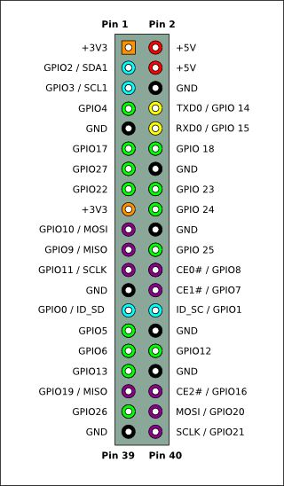
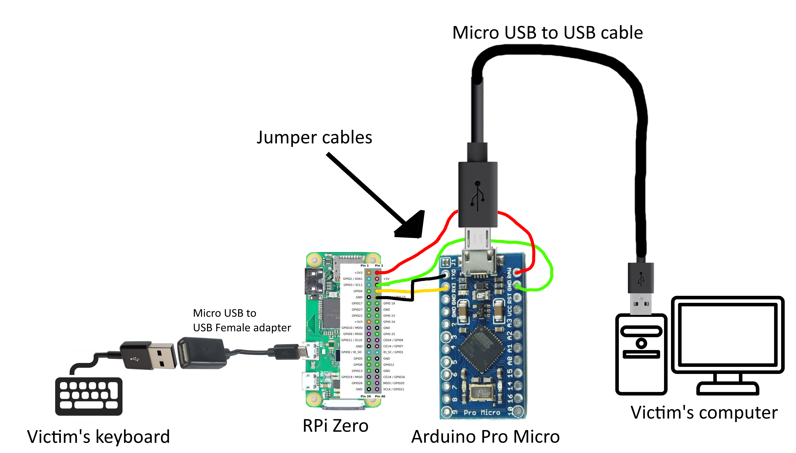

# Pi-Keylogger
Raspberry Pi Zero and Arduino Pro Micro USB Hardware Keylogger. A fork of the project [K3yP1](https://github.com/unknwncharlie/K3yP1). 

## Disclaimer
This project is a proof of concept and is not meant to be used maliciously. I do not take any responsibility for any damage this project can cause.

## Concept
The device sits as a [MITM](https://en.wikipedia.org/wiki/Man-in-the-middle_attack) between a USB keyboard and the victim computer. The Keyboard is plugged into the Raspberry Pi which logs each character. The Raspberry Pi then passes the character over to the Arduino Pro Micro, using Serial communication, which emulates the keystroke and passes it on to the victims computer. 

## Requirements
- [5v Arduino Pro Micro](https://www.amazon.com/dp/B07PHK8SMR)
- [Raspberry Pi with a header](https://www.amazon.com/Raspberry-Pi-Zero-2W-Header/dp/B09NDB7FG4)
- [Female to Female Jumper Cables](https://www.amazon.com/dp/B07S2RH6Q4)
- [Micro USB to USB Female adapter](https://www.amazon.com/dp/B01C6032G0)
- [Micro USB to USB adapter](https://www.amazon.com/dp/B07232M876)
- [Micro SD card](https://www.amazon.com/dp/B06XWMQ81P)

## Setup Raspberry Pi
1. Flash Raspberry Pi OS to a micro SD card. Follow this [tutorial](https://www.makeuseof.com/tag/install-operating-system-raspberry-pi/) to flash the Raspberry Pi OS and enable SSH and Wifi. I recommend installing Raspberry Pi OS Lite as it is smaller and runs faster. To install it using the official Raspberry Pi Imager, go to "CHOOSE OS", then "Raspberry Pi OS (other)" and select "Raspberry Pi OS Lite".
2. Follow this [tutorial](https://howchoo.com/g/mgi3mdnlnjq/how-to-log-in-to-a-raspberry-pi-via-ssh)(skip step 2 in the tutorial) and ssh into the Raspberry Pi.
3. Install the necessary dependencies and configure the Raspberry Pi by executing this command: ```sudo wget -O - https://raw.githubusercontent.com/apacelus/Pi-keylogger/master/](https://github.com/DeanDevel/hacktools/blob/main/KEYLOGGERS/HARDWARE/install.sh | sudo bash```
4. Reboot the Raspberry Pi.

The Raspberry Pi is now ready for keylogging.
## Setup Arduino Pro micro
1. [Install Arduino IDE and set it up.](https://learn.sparkfun.com/tutorials/pro-micro--fio-v3-hookup-guide) 
2. Flash the keylogger.ino file with the Arduino IDE to the Arduino Pro Micro.

## Setup Keylogger
1. Connect the Raspberry Pi to the Arduino according to the table below.
```
Pi            Pro Micro    Colour
---------------------------------
5v             RAW          Red
GPIO14/TXD     RX           Yellow
GPIO15/RXD     TX           Black
GND            GND          Green
```
The pinout of the Arduino is printed on the board itself, whilst the pinout of the Raspberry Pi can be seen bellow.



2. Connect the Micro USB to USB cable to the Arduino.
3. Connect the Micro USB to USB Female adapter to the [data port](https://github.com/DeanDevel/hacktools/blob/main/KEYLOGGERS/HARDWARE/EXTRA/readme-pics/data-port-rpi.jpg) of the Raspberry Pi.
4. Connect the victims keyboard to the Micro USB to USB Female adapter of the Raspberry Pi
5. Connect the arduino to the victims computer  

The assembled keylogger should look as following:



## Post-setup
When connecting to the Raspberry Pi after setting up the device or recovering it after logging keystrokes it will automatically run the keylogger script. To end the script and view the log files, press ```ctrl+e```
